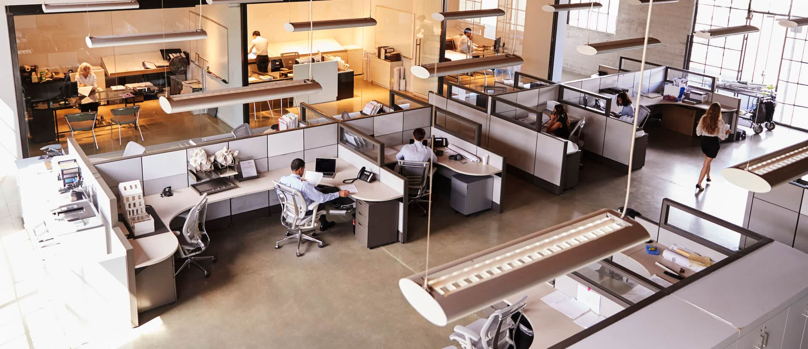

# **Optimizing Office Layouts in Revit Using Dynamo Generative Design and Machine Learning**

## **Project Overview**
This project focuses on the **optimization of office layouts** in Revit by leveraging **Dynamo's Generative Design capabilities** combined with **machine learning** to produce efficient, functional, and aesthetically pleasing designs. The project aims to enhance productivity and usability in office spaces while maintaining compliance with design standards such as clearance between furniture and accessibility requirements.



---

## Purpose  
- To design an efficient and data-driven tool that maximizes the number of desks in an office layout while ensuring comfort, accessibility, and compliance with design constraints.
- To integrate generative design (Revit Dynamo) and machine learning (Python) into a practical solution for architects and designers to make informed decisions.

## Learning Outcome
- Gain foundational skills in generative design.
- Learn how to integrate data analysis and machine learning for design optimization.
- Develop a decision-making tool that visualizes and ranks layouts.

## Structure
1. **Introduction**
    - Overview of the problem (efficient office layouts).
    - Importance of integrating generative design and machine learning.
2. **Tools and Technologies**
    - Revit Dynamo (generative design).
    - Python (data analysis, data visualization, and machine learning).
    - Visualization tools (Power BI or/and Python).
    - Other if necessary: Revit API, Scikit-Learn, TensorFlow.
3. **Workflow Breakdown**
    - Design generation.
    - Data extraction and preprocessing.
    - Machine learning analysis and ranking.
    - Visualization and decision-making.
4. **Evaluation Metrics**
    - Number of desks.
    - Accessibility (aisle widths).
    - Additional factors like proximity to windows.

---

## **Project Workflow**
### **Step 1: Model Preparation in Revit**
- Created office spaces with predefined room separators and layouts.
- Added essential furniture such as desks, chairs, countertops, sinks, and lighting fixtures.

### **Step 2: Generative Design with Dynamo**
- Defined constraints (e.g., minimum distances between objects and walls).
- Set goals such as maximizing the number of objects placed while minimizing overlap.
- Used Dynamo's **Generative Design** feature to explore multiple layout options.

### **Step 3: Machine Learning Integration**
- Collected design feedback to train models for predicting optimal layouts.
- Implemented algorithms to balance clearance, functionality, and space utilization.

### **Step 4: Visualization**
- Exported models to **FBX format** and visualized in Python using **Vedo**.
- Embedded 3D models on a web page for interactive exploration using **Forge Viewer**.

### **Step 5: Validation**
- Performed clash detection using **Navisworks** to ensure practical viability.
- Incorporated necessary adjustments to resolve issues before finalizing.

---

## **Technologies Used**
- **Autodesk Revit**: Primary design tool.
- **Dynamo**: Automation and Generative Design workflows.
- **Python**: Data processing, visualization (Vedo).
- **Navisworks**: Clash detection and validation.
- **Forge Viewer**: Web-based 3D visualization.
- **Machine Learning Libraries**: Scikit-learn/TensorFlow (for predictive modeling).

---

## **How to Use**
### **Setup**
1. Clone the repository:
   ```bash
   git clone https://github.com/nafisatibrahim/office-layout-optimization_machine_learning.git
   ```
2. Install required dependencies for Dynamo, Python, and Forge Viewer:
   - Python: Install libraries like `vedo`, `pandas`.
   - Forge Viewer: Follow [Forge Viewer documentation](https://forge.autodesk.com/en/docs/viewer/v7/).

3. Ensure you have **Revit**, **Navisworks**, and Dynamo installed.

### **Execution**
1. Open the **Dynamo script** in Revit.
2. Define input parameters such as:
   - Room dimensions.
   - Distance constraints (e.g., 3 feet between desks).
   - Optimization goals (maximize desks, minimize overlap).
3. Run the **Generative Design study**.
4. Export the best layout for further rendering or clash detection.

### **Visualization**
- Use **Vedo** to render the 3D model in Python.
- Embed the 3D model on a webpage using Forge Viewer.

---

## **Sample Outputs**
1. **Generative Design Layouts**:
   - Visual representation of optimized office layouts.
2. **Interactive 3D Models**:
   - Embedded web-based exploration using Forge Viewer.
3. **Clash-Free Design**:
   - Validated layouts after running Navisworks.

---

## **License**
This project is licensed under the MIT License - see the [LICENSE](LICENSE) file for details.

---

